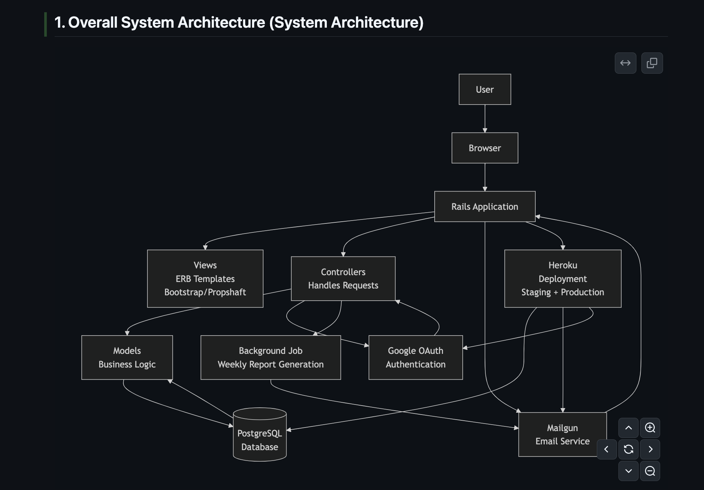

Architecture Decision Records (ADRs)
====================================

###\
ADR-001: User Authentication via Google OAuth

-   Status: Accepted

-   Context: We need a secure and user-friendly way for users to sign up and log in. Building a custom authentication system with password management is complex and adds security risks.

-   Decision: We decided to use Google OAuth as the sole method for user authentication.

-   Consequences:

-   Pro: Reduces development time and enhances security by leveraging Google's trusted platform.

-   Pro: Users do not need to remember a new password, leading to a better user experience.

-   Con: Users without a Google account cannot use the application. This is an acceptable trade-off for the target audience.

### ADR-002: Choice of Database System

-   Status: Accepted

-   Context: The application requires a relational database to store user data, events, and stats with clear relationships between them.

-   Decision: We decided to use PostgreSQL for all environments (development, test, and production).

-   Consequences:

-   Pro: PostgreSQL is robust, open-source, and the standard for production-grade Rails applications.

-   Pro: It is well-supported by Heroku, our intended deployment platform.

-   Con: Requires developers to have PostgreSQL installed on their local machines, which is a reasonable prerequisite.

